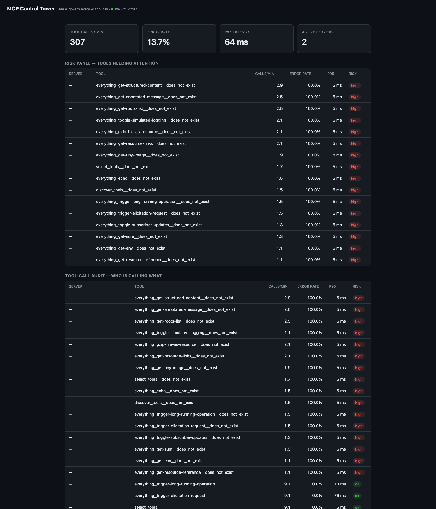
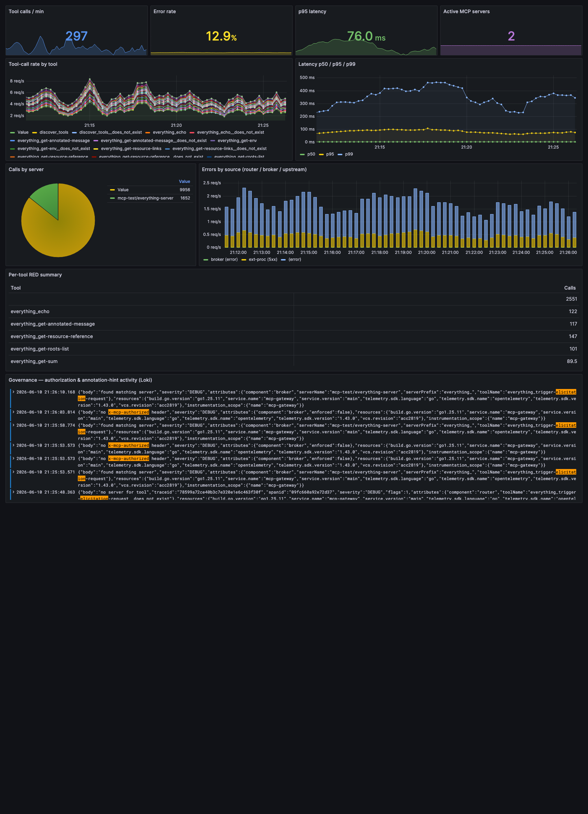
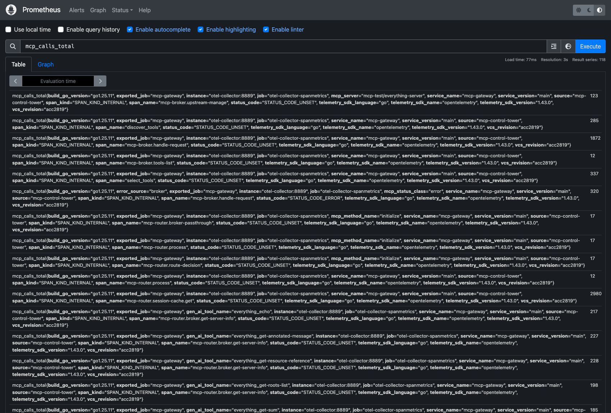

# MCP Control Tower

**See and govern every AI tool call flowing through [Kuadrant/mcp-gateway](https://github.com/Kuadrant/mcp-gateway).**

MCP Control Tower is a standalone observability **and governance** layer for the MCP Gateway. It
turns the traces and logs the gateway *already emits* into MCP-native dashboards and a live
governance view — **who called which tool, on which server, and was it allowed, denied, or risky.**

It is built entirely on signals present in the gateway's current `main`. No changes to the gateway
are required: a single OpenTelemetry Collector derives per-tool/per-server RED metrics from the
gateway's spans (via the `spanmetrics` connector), and the console flags risky tools from their
observed error rate and latency (plus an optional high-risk allowlist).

It delivers the dashboards + per-tool/server metrics + traffic-visibility that two accepted
observability epics target — on current `main`, no gateway changes:

- [#161](https://github.com/Kuadrant/mcp-gateway/issues/161) — metrics + default Grafana dashboards
- [#25](https://github.com/Kuadrant/mcp-gateway/issues/25) — Auditing, Logging, and Metrics

For the exact, honest scope — what's covered, what's partial, and what needs gateway-side data
(per-user metrics, payload sizes, identity audit trail) — see [docs/coverage.md](docs/coverage.md)
and the metric catalog in [docs/METRICS.md](docs/METRICS.md).

## Live demo

Captured against a real MCP Gateway (`make local-env-setup`) with the simulator driving mixed
traffic — every number below is derived from the gateway's own OTel spans, with no gateway changes.

**Control Tower console (Phase 2)** — live tool-call audit + risk panel flagging misbehaving tools:



**Grafana dashboard (Phase 1)** — per-tool/per-server RED metrics, errors by source, and the
governance log row, all from the `spanmetrics` connector:



**Prometheus** — the MCP RED metrics derived from gateway traces (`mcp_calls_total` by
`mcp_server`, `gen_ai_tool_name`, `mcp_method_name`, `mcp_status_class`, `error_source`):



## Why it matters

Generic observability stacks see HTTP requests. They do **not** understand MCP: that
`tools/call` carries a tool name and a target server, that some tools are `destructive` or
`openWorld`, that `x-mcp-authorized` filtering denied a call, or that an elicitation round-trip
stalled. Control Tower is **MCP-semantic** — it reads those signals and presents them as the
questions an MCP gateway operator actually asks.

## Two phases

| Phase | What | Built on |
|---|---|---|
| **1 — Observability & Governance Plane** | One-command stack (Collector + Tempo + Loki + Prometheus + Grafana) with MCP-native dashboards and a traffic simulator. | Gateway spans/logs today. |
| **2 — Control Tower console** | A Go service + lightweight web UI: live tool-call map, per-user/per-tool audit trail, and a risk panel. | Same signals, MCP-aware model. |

## Quick start

```bash
make up        # observability/governance stack + wire the gateway to it
make traffic   # drive mixed MCP traffic (success + deliberate errors)
make forward   # Grafana on http://localhost:3000, Prometheus on :9090
make down      # tear it all down
./demo.sh      # one-shot narrated demo
```

Phase 2 — the Control Tower console:

```bash
make forward                      # (Prometheus must be reachable)
make console                      # run the console locally on http://localhost:8080
# or, in-cluster:
make console-deploy && make console-forward
```

## What you see

- **Tool-call rate / latency (p50/p95/p99) by server and tool** — from gateway spans.
- **Error & 404 attribution** — by `error_source` (router vs broker vs upstream).
- **Authorization denials & capability filtering** — from `x-mcp-authorized` activity.
- **Elicitation funnel** — `tools/call` → `elicitation/create` → completion.
- **Governance row** — who → what tool → allowed/denied, with risk flags for
  `destructive` / `openWorld` tools.

## Layout

```text
deploy/       collector + tempo + loki + prometheus + grafana manifests
enrichment/   collector config: spanmetrics connector + MCP risk tagging
dashboards/   MCP-native Grafana dashboard JSON
simulator/    traffic generator (reuses the gateway's test servers)
console/       Phase 2: Go backend + web UI
docs/         architecture, walkthrough, and the integration pitch
```

> Not affiliated with or endorsed by the Kuadrant project. A demonstration built on top of the
> open-source MCP Gateway.
